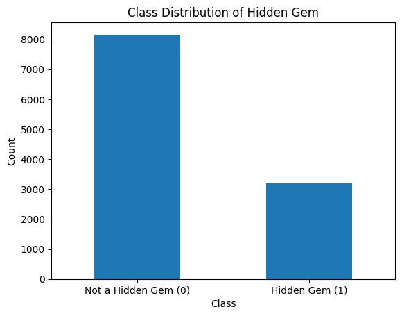
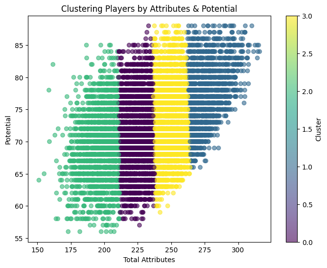

# FIFA 18 Player Valuation Project

## Project Overview
This project aims to help a football club with a tight budget identify high-potential players with strong resale value. We use data from FIFA 18 to develop a classification model that predicts player profitability.

## Business Problem
Football clubs with limited budgets must make strategic player investments. Identifying undervalued players who can develop and be sold for a profit is crucial. Using historical FIFA 18 data, we apply machine learning techniques to predict which players will yield high resale value.

## Data Used
The dataset includes key attributes such as:
- Age
- Overall rating
- Potential rating
- Value
- Wage
- Special attributes (skills, weak foot, etc.)
- Position

## Methodology
1. **Data Preprocessing:**
   - Handled missing values
   - Encoded categorical variables
   - Scaled numerical features
   
2. **Feature Engineering:**
   - 1. Market Value Efficiency:
       Checking player value per million. This metric measures how efficiently a player’s current attributes (e.g., skills) contribute to their market value. A higher ratio indicates that the player is undervalued based on their abilities.
        helps you identify players who are undervalued relative to their performance on the field. This is particularly useful for scouting players who perform well but might be overlooked in the transfer market.
   - 2. Value-for-Money Index:
        This metric evaluates a player's potential against their market value. It shows how much potential a player has relative to their price.
        Potential: The player's maximum achievable rating.
      Value: The player's market value.
        Value-for-Money Index is crucial for identifying players who have high potential but are available at a relatively low price. Teams can focus on these players for recruitment, as they offer a great return on investment.

     3. Used Adjusted Value Efficiency Ratio (VER) to estimate cost-effectiveness
   -  Value Efficiency Ratio) is designed to capture a player’s value efficiency by taking into account both their potential (growth            potential) and the financial factors (value and wage). This allows a more holistic evaluation of a player's worth compared to             their potential improvement.
   -  The Adjusted VER combines several factors (such as Potential, Overall, Age, and Value) to quantify the player's expected growth or future value relative to their current status.
   - formula attempts to create a measure of how efficiently a player's value is aligned with their potential and age. This can help identify players who are undervalued based on their potential and age.
   - Adjusted VER is a key metric because it identifies players with high growth potential while considering their current market value. This is useful for teams looking for undervalued players who could be developed further.
     4. Metric to Identify Hidden Gems
   - A player is classified as a Hidden Gem if they perform well in terms of Adjusted VER, Market Value Efficiency, and Value-for-Money Index, while also being undervalued (based on their market price).
   - The Hidden Gem flag is used to identify players who might be undervalued based on their potential and overall attributes. These players might be overlooked or not highly valued by the market, but they have potential to outperform their value. In the context of a football club, these would be the kinds of players that could be bought at a relatively low cost but have a high chance of becoming star players or providing a good return on investment. We used Percentile filtering to  exclude players who are statistical outliers. 

   
4. **Modeling Approach:**
   - **Baseline Model:** We started with a simple logistic regression model to establish a reference point.
   - Target-Hidden Gems
   - Predictors-Age,Potential,Overall, Wage
   - Model performed extremely well with an accuracy score of 98%,Precision of  98% and Recall of 1.00 for
   - But model seemed to be highly biased toward predicting the majority class (0), which is common in imbalanced datasets
   - )
   - using SMOTE (Synthetic Minority Over-sampling Technique) to balance the classes and then applying class weights to Logistic Regression:
   - Accuracy: 0.93 — The model is performing well overall, correctly predicting around 93% of the instances.
   - Precision (for 1, Hidden Gem): 0.81 — The model is now more accurate in predicting Hidden Gems, although there’s still room for improvement in reducing false positives.
   - Recall (for 1, Hidden Gem): 0.96 — The model is very good at identifying Hidden Gems, with a high recall, meaning it’s correctly identifying most of them.
   - When testing for Overfitting:
   - Training Performance: Precision for Class 1 is 0.50, and recall for Class 1 is 1.00. The model identifies all Hidden Gems (recall = 1), but it struggles to correctly classify the majority class (0).
   - The accuracy of 0.50 suggests the model is guessing in a balanced way, but it’s not learning useful patterns from the data.
Overfitting Indicators:
High recall for class 1 in training, but poor precision, indicates that the model is biased toward predicting class 1 (Hidden Gems).
True Negatives (TN): 1534 — Correctly identified non-hidden gems.
False Positives (FP): 133 — Incorrectly identified non-hidden gems as hidden gems.
False Negatives (FN): 23 — Missed hidden gems.
True Positives (TP): 580 — Correctly identified hidden gems.
   - **Decision Tree:** Introduced to capture non-linear patterns in player valuation.
   - **Random Forest:** Used for improved predictive power and robustness, helping us understand the impact of various features on future resale value.

## Evaluation Metrics
Since this is a classification problem, we focused primarily on **precision**, ensuring that the model correctly identifies profitable players while minimizing false positives.

## Visualizations & Interpretations
We generated several visualizations to support our analysis:

### 1. Cluster Analysis of Players

- Players were segmented into four clusters based on key attributes like age, potential, and market value.
- This helped us identify distinct groups of players who might be undervalued gems.

### 2. Age vs. Market Value

- Younger players tend to have a higher resale value potential, while older players depreciate quickly.
- Clubs should prioritize investing in players under 25 to maximize resale opportunities.

### 3. Age Distribution

- The dataset is skewed towards younger players, which aligns with the scouting approach of top clubs.

### 4. Average Age vs. Wage and Market Value

- Shows how wages and market value change with age.
- High-value players tend to be in the mid-20s, indicating peak resale potential.

### 5. Average Wage & Value by Rating

- Highlights how wage scales with a player's overall rating.
- Some players may be overpaid relative to their resale potential.

### 6. Overall & Potential vs. Age

- Players with high potential tend to be younger, reinforcing the importance of scouting for future growth.

## Conclusion
- **Precision was the key metric**, ensuring we minimize investment in unprofitable players.
- **Random forest provided better insights** into which features drive future resale value.
- **Investing in young, high-potential players is the best strategy for financial sustainability.
